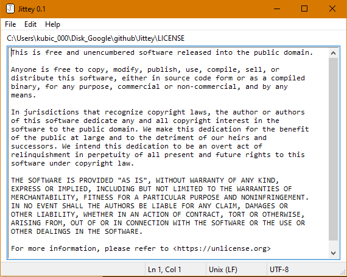

# Jittey
**Jittey** (**J**acob's **T**errific **T**ext **E**ditor) is a single-file basic text editor written in pure C and Win32, there is no real reason to use it, but it can serve as a good reference. It is my first Win32 project and it took me 3 weeks (~100 hours) to finish (although there are still many TODO's.) Because I didn't find almost anything like this and had to dig through the documentation myself, I decided to put it onto the internet for other people starting out with Win32. The whole repository is in the public domain, so you can do anything with it. Bugfixes and improvements are highly encouraged.



## Compiling
Compiling the source code is extremely easy on both MSVC and MinGW64, first compile the resource script and then the executable:
### MSVC (Command line)
For MSVC, we can use it's resource compiler `rc` and the command line C/C++ compiler `cl`, where we just specify the source files and link the necessary libraries which come with the Windows SDK, their path may differ, this is it for me:
```
rc /r /fo outres.res rds.rc
cl main.c outres.res /Fe:jittey.exe /link /LIBPATH:"C:\Program Files (x86)\Windows Kits\10\Lib\10.0.18362.0\um\x86\" User32.Lib Gdi32.Lib Comdlg32.Lib Comctl32.Lib Advapi32.Lib Shell32.Lib
```
### MinGW64, TDM-GCC
The process is farily similar on MinGW, the library path is set automatically, as MinGW comes with it's own Windows SDK. To my surprise, it also comes with a tool called `windres`, which is basically the equivalent of `rc`. Note that gcc supports only `.coff` files, so we cannot feed it `.res` files.
```
windres -i rds.rc -o outres.coff
gcc main.c outres.coff -lUser32 -lComdlg32 -lgdi32 -lMsimg32 -lComctl32 -o jittey.exe
```